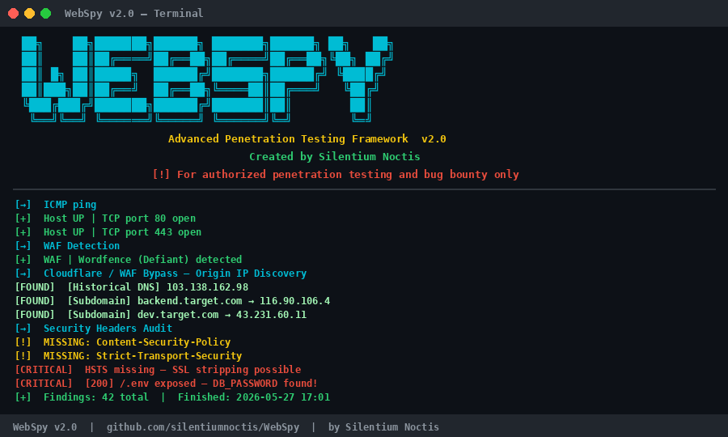

<div align="center">

```
 ██╗    ██╗███████╗██████╗ ███████╗██████╗ ██╗   ██╗
 ██║    ██║██╔════╝██╔══██╗██╔════╝██╔══██╗╚██╗ ██╔╝
 ██║ █╗ ██║█████╗  ██████╔╝███████╗██████╔╝ ╚████╔╝
 ██║███╗██║██╔══╝  ██╔══██╗╚════██║██╔═══╝   ╚██╔╝
 ╚███╔███╔╝███████╗██████╔╝███████║██║        ██║
  ╚══╝╚══╝ ╚══════╝╚═════╝ ╚══════╝╚═╝        ╚═╝
```

# WebSpy v2.0
### Advanced Penetration Testing Framework

[](https://python.org)
[](https://kali.org)
[](LICENSE)
[](https://github.com/SilentiumNoctis)
[]()

> *"They locked their doors. They patched their walls. They prayed their firewalls would hold.  
> But no wall was ever built that silence couldn't cross."*  
> — **Silentium Noctis**

**For authorized penetration testing and bug bounty only.**

</div>

---

## What is WebSpy?

WebSpy is an all-in-one **automated penetration testing framework** built for Kali Linux. It wraps powerful security tools (nmap, gobuster, nikto, sublist3r, wafw00f, whatweb) and adds custom Python modules — giving you a single command to perform deep reconnaissance, vulnerability discovery, and web application security assessment.

All results are **filtered and actionable** — no raw dumps, only what matters.

---

## Features

| Category | Modules |
|----------|---------|
| **Reconnaissance** | WHOIS, DNS records, Historical DNS, ASN lookup, Certificate Transparency |
| **WAF & Tech** | Cloudflare bypass (5 methods), WAF fingerprinting, tech stack detection |
| **Network** | TCP/UDP port scan, host check, FTP service audit, SSH banner + auth methods |
| **Web App** | Directory busting, JS secret analysis, PHP surface scan, security headers |
| **Vulnerabilities** | XSS detection, CSRF + Broken Access Control, IDOR, API misconfiguration |
| **Data Exposure** | Sensitive file leaks (.env, .git, backups), cookie/session analysis, S3 buckets |
| **API Security** | API endpoint discovery, GraphQL introspection, CORS misconfiguration |
| **Evasion** | User-Agent rotation, timing jitter, packet fragmentation, decoy IPs |

---

## Installation

### One-Command Setup

```bash
git clone https://github.com/SilentiumNoctis/WebSpy.git
cd WebSpy
chmod +x install.sh
sudo ./install.sh
```

The installer will automatically:
- Install all required Kali Linux tools (`nmap`, `gobuster`, `nikto`, `sublist3r`, `wafw00f`, `whatweb`)
- Install Python dependencies
- Set executable permissions
- Add `webspy` to system PATH

### Manual Install

```bash
git clone https://github.com/SilentiumNoctis/WebSpy.git
cd WebSpy
pip3 install -r requirements.txt
chmod +x webspy.py
```

### Requirements

- **OS:** Kali Linux (recommended) / any Debian-based system
- **Python:** 3.8+
- **Tools:** nmap, gobuster, nikto, sublist3r, wafw00f, whatweb

---

## Usage

### Interactive Mode *(Recommended)*
```bash
python3 webspy.py
```
Tool will ask you everything — target, mode, timing, evasion, modules.

### Command Line

```bash
python3 webspy.py -t <target> [options]
```

### Scan Modes

| Flag | Mode | Description |
|------|------|-------------|
| `-m passive` | Passive OSINT | Zero direct contact — WHOIS, DNS, CT logs |
| `-m active` | Active Scan | Direct vuln checks — ports, headers, XSS, CSRF |
| `-m bypass` | WAF Bypass | Cloudflare/WAF origin IP discovery |
| `-m full` | Full Pentest | All modules — complete assessment |

---

## All Flags

```
TARGET:
  -t, --target <domain/IP>   Target domain or IP

SCAN MODES:
  -m passive                 Passive OSINT (no direct contact)
  -m active                  Active scanning
  -m bypass                  Cloudflare/WAF bypass
  -m full                    Full scan — all modules

MODULES:
  --ping                     Host up/down check
  --whois                    WHOIS + ASN lookup
  --waf                      WAF fingerprinting (wafw00f)
  --tech                     Web tech detection (whatweb)
  --cf                       Cloudflare bypass — origin IP discovery
  --sub                      Subdomain enumeration
  --tcp                      TCP port scan (nmap -sV -sC)
  --udp                      UDP port scan (needs sudo)
  --dir                      Directory & file busting (gobuster)
  --s3                       S3 bucket discovery
  --headers                  Security headers audit
  --js                       JavaScript analysis — secrets, endpoints
  --php                      PHP surface scan
  --nikto                    Nikto web server scan
  --ftp                      FTP anonymous/default login check
  --ssh                      SSH banner grab + auth method audit
  --sensitive                Sensitive file leaks (.env, .git, backups)
  --cookie                   Cookie & session security analysis
  --xss                      XSS + DOM sinks + SSTI detection
  --csrf                     CSRF + Broken Access Control + IDOR
  --api                      API endpoints + CORS + GraphQL introspection

CONTROL:
  -T <1-5>                   Timing: 1=Stealth → 5=Insane (default: 3)
  -e, --evasion              Enable evasion (UA rotation, jitter, fragmentation)
  -D, --depth <1-5>          Crawl depth (default: 2)
  -p, --ports <ports>        Custom ports e.g. 80,443 or 1-1000
  --proxy <host:port>        HTTP proxy (Burp, ZAP)
  --tor                      Route through Tor

OUTPUT:
  -o, --output <file>        Save as text file
  -j, --json <file>          Save as JSON report
  -v, --verbose              Show raw tool output
  -q, --quiet                Show findings only
```

---

## Examples

```bash
# Interactive mode — tool asks everything
python3 webspy.py

# Full pentest with stealth timing
python3 webspy.py -t example.com -m full -T1 -e -o report.txt

# Cloudflare bypass — find real origin IP
python3 webspy.py -t example.com --cf -T3

# Subdomain enumeration + dir busting (aggressive)
python3 webspy.py -t example.com --sub --dir -T4

# Web vulnerability audit (XSS, CSRF, API, cookies)
python3 webspy.py -t example.com --xss --csrf --api --cookie --sensitive -T3

# FTP + SSH service audit on internal IP
python3 webspy.py -t 192.168.1.1 --ftp --ssh --tcp -T3

# Full scan through Burp Suite proxy
python3 webspy.py -t example.com -m full --proxy 127.0.0.1:8080 -o report.txt -j report.json

# Bug bounty quick workflow
python3 webspy.py -t example.com --sub --cf --s3 --js --headers -T4 -o bb_report.txt

# Through Tor (anonymous)
python3 webspy.py -t example.com -m bypass --tor

# UDP scan (needs root)
sudo python3 webspy.py -t example.com --udp -T2
```

---

## Timing Profiles

| Level | Name | Delay | Threads | Use Case |
|-------|------|-------|---------|----------|
| `-T1` | Stealth | 3s | 2 | IDS/IPS evasion |
| `-T2` | Polite | 1s | 5 | Low noise |
| `-T3` | Normal | 0.3s | 15 | Default |
| `-T4` | Aggressive | 0.05s | 30 | Fast recon |
| `-T5` | Insane | 0s | 60 | Max speed |

---

## Evasion Techniques

When `-e` flag is used, WebSpy activates:

- **User-Agent rotation** — Cycles through browsers, mobile, and search bots
- **Timing jitter** — Randomizes delays ±50% to avoid pattern detection
- **IP header spoofing** — Adds random `X-Forwarded-For`, `X-Real-IP`
- **Packet fragmentation** — nmap `-f --data-length` to bypass signature IDS
- **Decoy scanning** — nmap `-D RND:5` adds 5 fake source IPs

---

## Cloudflare Bypass — 5 Methods

WebSpy uses 5 independent methods to discover real origin IPs:

1. **Historical DNS** — HackerTarget API for old DNS records
2. **Subdomain scan** — 40+ common subdomains that bypass CDN
3. **MX / SPF records** — Email server IPs often reveal origin
4. **SSL certificate SAN** — Extract domains from TLS cert
5. **Header injection** — Test bypass headers (X-Forwarded-For, CF-Connecting-IP)

---

## Security Modules Detail

### Sensitive File Leak (`--sensitive`)
Tests 40+ paths including `.env`, `.git/HEAD`, `backup.zip`, `wp-config.php`, `phpinfo.php`, error logs, AWS credentials, private keys. Scans content for passwords, API keys, JWT tokens, DB connection strings.

### XSS Detection (`--xss`)
Tests reflected XSS with 9 payloads on all discovered parameters. Checks DOM sinks (`innerHTML`, `eval()`, `document.write`). Detects SSTI (`{{7*7}}`).

### CSRF + BAC (`--csrf`)
Checks all forms for CSRF tokens. Tests 18 admin paths for unauthorized access. Tries 6 header-based 403 bypass techniques. Detects IDOR via parameter enumeration.

### API Security (`--api`)
Discovers 24 common API paths. Detects GraphQL introspection. Tests CORS misconfiguration with reflected origin + credentials check.

### Cookie Analysis (`--cookie`)
Checks Secure, HttpOnly, SameSite flags. Detects JWT tokens, MD5-like weak session IDs. Generates XSS cookie-steal PoC.

---

## Screenshots



---

## Output Sample

```
════════════════════════════════════════════════════════════
 Target  : example.com
 Mode    : full
 Timing  : T3 — Normal
 Evasion : OFF
════════════════════════════════════════════════════════════

[+] Host UP | TCP port 80 open
[+] Host UP | TCP port 443 open
[+] WAF | Cloudflare detected
[FOUND] [Historical DNS] 104.21.45.67
[FOUND] [Subdomain] dev.example.com → 192.168.1.100
[CRITICAL] [200] https://example.com/.env (2048b)
[CRITICAL]   SECRET FOUND → DB_PASSWORD=SuperSecret123
[CRITICAL] REFLECTED XSS found! Parameter: search
[CRITICAL] CSRF TOKEN MISSING on POST form → /user/update
[FOUND] API [200] /api/v1/users (JSON:True)
```

---

## Legal Disclaimer

> This tool is intended **only** for authorized security testing, bug bounty programs, and educational purposes. Running WebSpy against systems you do not own or have explicit written permission to test is **illegal** and unethical.
>
> The author — **Silentium Noctis** — holds no responsibility for any misuse or damage caused by this tool. You are solely responsible for your actions.

---

## Author

<div align="center">

**Silentium Noctis**  
*Cybersecurity Professional | Penetration Tester | Security Researcher*  
*Certified: CRTOM | CRPO | ICIP*

> *"The shadows don't hide me. They work for me."*

[](https://github.com/SilentiumNoctis)

</div>

---

## Contributing

Pull requests are welcome. For major changes, please open an issue first.

1. Fork the repo
2. Create your branch (`git checkout -b feature/new-module`)
3. Commit your changes (`git commit -m 'Add new module'`)
4. Push to the branch (`git push origin feature/new-module`)
5. Open a Pull Request

---

<div align="center">

**Made with ❤️ and a lot of dark coffee by Silentium Noctis**

*"I do not hack systems. I whisper to them — and they open for me."*

</div>
